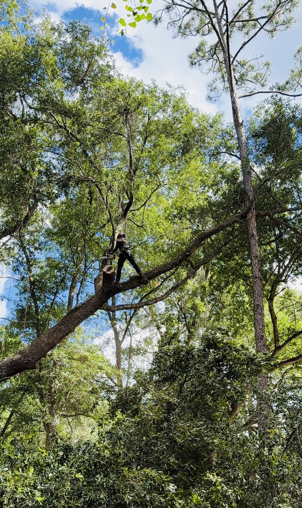
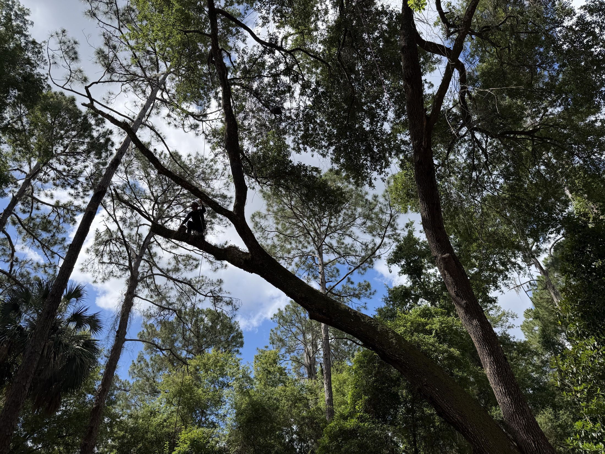
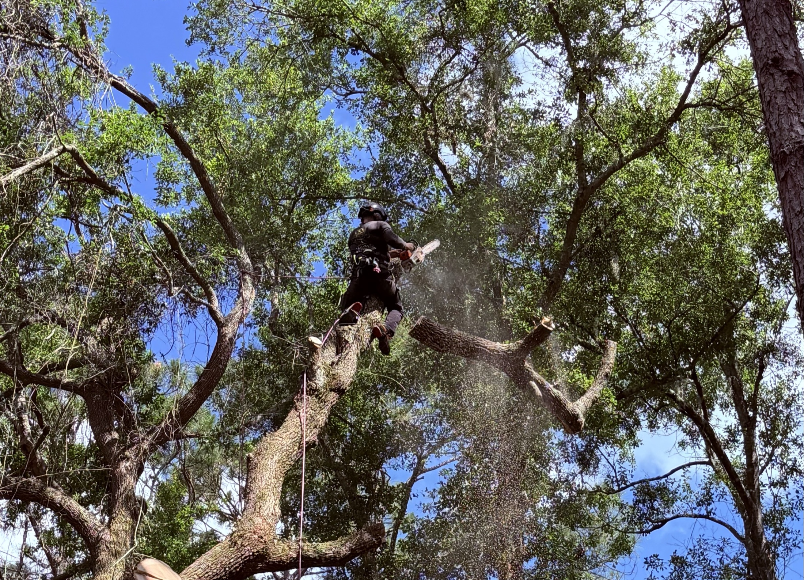
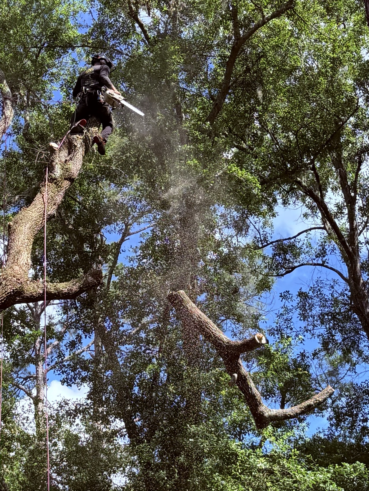

Some jobs are a good reminder that the right answer is usually the smaller one. This was one of them: a mature live oak with a long lateral lead that had grown out until it was rubbing a neighboring pine and reaching out over a campsite. The owner wanted it handled. A lot of crews would have quoted a removal. We pruned it.

*Up the line and out onto the lead — spikeless, because this is a tree we're keeping.*

## The setup: a lead reaching over a campsite

The oak itself was healthy. The problem was one over-extended lateral lead that had gotten heavy and long. Two things made it worth addressing now: it was **rubbing against an adjacent pine**, and it **reached out over a campsite** where people spend time underneath it.

Rubbing matters more than it looks. Where two limbs grind together, the bark wears through, and that wound becomes an open door for decay and pests on both trees. And anything heavy and over-extended above a spot where people gather is a target worth taking seriously — not with alarm, just with a plan.

So the assessment was straightforward: the tree is worth keeping, the defect is one lead, reduce the lead and end the rub. No reason to take the whole oak down.

*The lead in question — a heavy lateral reaching out across the space below.*

## Spikeless, on a single line

We climbed it on a single rope, with no climbing spikes. This is not a small detail.

Spikes (gaffs) are for removals only. Every spike a climber kicks into the trunk is a puncture wound through the bark and into the living tissue underneath — exactly the kind of opening that lets decay in. Spiking a tree you intend to keep quietly damages it for the sake of a faster climb. On any prune, the standard is to climb on rope and leave the bark intact. That's how we do it, every time.

## Drop where it's open, rig where it's not

The camp area under most of the work was open ground, so for the bulk of it we could let cut pieces drop and clean them up after — simple and efficient. The sections that hung over the pine, or near anything that mattered, were the ones we rigged and lowered under control. Right technique for each piece, not rigging for its own sake.

The cuts themselves followed [ANSI A300 pruning](/services/tree-pruning/) practice: reduction cuts back to sound lateral branches to shorten and lighten the lead and stop the rub against the pine. No topping, no stripping the interior bare. The goal is a tree that's lighter and safer over that campsite but still looks and grows like a live oak should.

*Reduction cuts to take weight off the over-extended lead.*

*Open ground underneath here, so this section came straight down for cleanup — the pieces that hung over the pine were the ones we rigged and lowered.*

## What we found while we were up there

Here's the part you only get from being in the canopy: from up on that lead, we could see a **second tree on the property with significant decay** that wasn't obvious from the ground.

We didn't turn it into a sales pitch. We brought it to the owner's attention, showed them what we were seeing, and explained what it means — so now that the risk is identified, they can make appropriate plans on their own timeline, whether that's monitoring it, a closer [risk assessment](/services/arborist-consulting/), or scheduling work before it fails on its own terms. Identifying a hazard before it becomes an emergency is one of the most valuable things a climber can do on a property, and it costs the owner nothing but a conversation.

## We didn't take the oak down

That's the headline. The live oak stayed. We reduced the problem lead to safe standards, ended the rub on the pine, took the weight off the span over the campsite, and left a healthy tree to keep growing. The owner walked away with the oak intact *and* a heads-up about a tree that genuinely needed attention.

That's the order we like to work in: save what's worth saving, do the smallest job that actually solves the problem, and tell you the truth about everything else we see.

Got a heavy limb reaching over something you care about? [Ask us for an assessment](/contact/) — we'll give you an honest read before anyone starts a saw.
